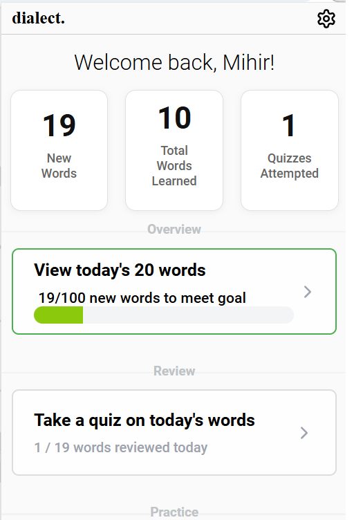
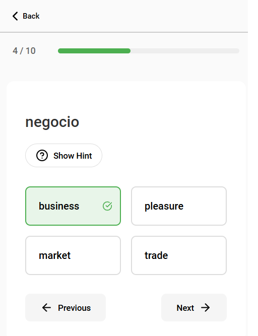
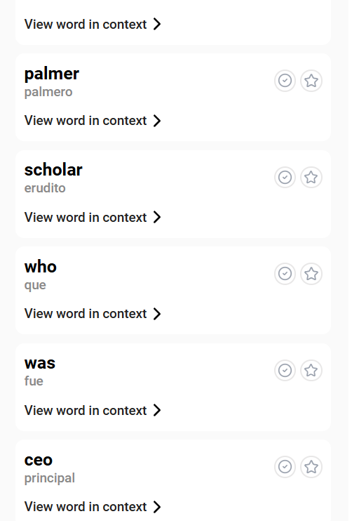
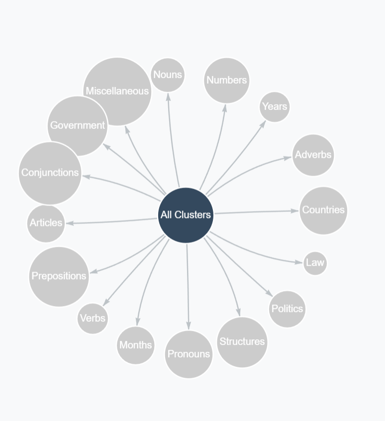

# dialect.

dialect. is a chrome extension that helps people passively learn a new language while normally surfing the web.

It randomly translates words/phrases/sentences on any webpage that the user is browsing and uses the power of context to better facilitate learning. The user can choose the difficulty as well as the frequency of the translation, and can always hover over the translated word to see the original text in case they don't understand. The extension also helps bilingual readers surf the web.

The users periodically take quizzes to test how they're learning, and the extension provides numerous resources for the users to check their progress, such as favourite words, mastered words, and a knowledge graph that creates clusters to help users understand what they've learnt.

    
    

    
    

## Stack

- React.js
- Express.js
- Chrome on-device APIs: Gemini Nano on-device
- Gemini 1.5-Flash API: server-side
